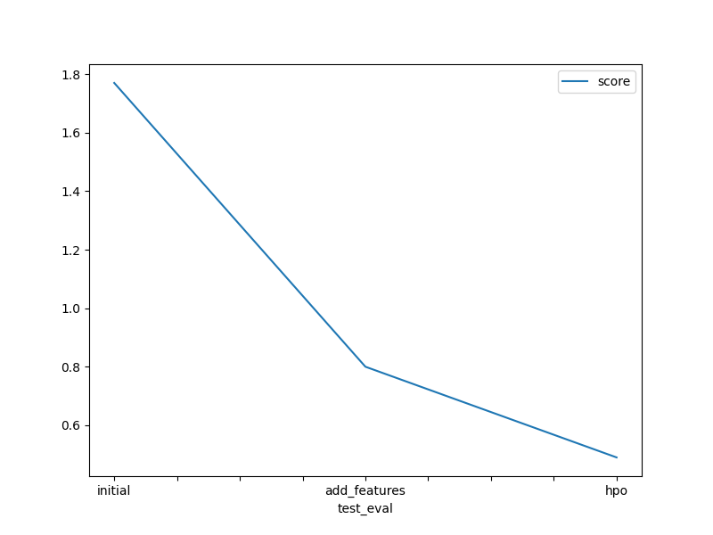

# Report: Predict Bike Sharing Demand with AutoGluon Solution
#### Alaa Mohamed

## Initial Training
### What did you realize when you tried to submit your predictions? What changes were needed to the output of the predictor to submit your results?
The initial predictions did not have negative values so I did not change anything. However, the count variable can not be of negative value and therefore any negative values need to be set to zero before submission. I did this step during the hyperparamter tuning requirement.

### What was the top ranked model that performed?
The top ranked model was WeightedEnsemble_L3 which is a weighted combination of different models with score value of -50.614.

## Exploratory data analysis and feature creation
### What did the exploratory analysis find and how did you add additional features?
During EDA I examined the features' data types and made some necessary conversions like converting some features to datetime and category. I visualized the features' histogram for better understanding the data and some insights. For example, bike sharing increases during working days. Also, temp and a temp features are nearly normally distributed.
I added new features from the datetime, converting it into separate month, hour, and day. 

### How much better did your model preform after adding additional features and why do you think that is?
In my case the additional features did not improve the performance that much. Well I think maybe a little more EDA and feature engineering are needed to determine the best features and wether there are any correlation between the features. The RMSE dropped from -50.6 to -50.49. Thus, more feature engineering is required to boost the performance.

## Hyper parameter tuning
### How much better did your model preform after trying different hyper parameters?
While the RMSE during training worsened. I noticed improvements in the kaggle testing score. Which suggests that the model generalize to unseen data better. However, I believe trying different combinations are ought to improve the RMSE as well.

### If you were given more time with this dataset, where do you think you would spend more time?
I would spend more time on data preparation and feature engineering. Since, Autogluon handles most of the hyperparameter tuning and model stacking internally. I believe the data is more important.

### Create a table with the models you ran, the hyperparameters modified, and the kaggle score.
|    | model        | hpo1                                         | hpo2                                                                    | hpo3                                                         |   score |
|---:|:-------------|:---------------------------------------------|:------------------------------------------------------------------------|:-------------------------------------------------------------|--------:|
|  0 | initial      | default                                      | default                                                                 | default                                                      |    1.73 |
|  1 | add_features | default                                      | default                                                                 | default                                                      |    1.81 |
|  2 | hpo          | GBM: num_boost_round: 100, num_leaves[26,66] | NN: num_epochs:10, learning_rate:[1e-4, 1e-2], dropout_prob: [0.0, 0.5] | XGB: n_estimators[100:500], max_depth[6,10], eta: [0.01,0.3] |    1.34 |

### Create a line plot showing the top model score for the three (or more) training runs during the project.

### Create a line plot showing the top kaggle score for the three (or more) prediction submissions during the project.

## Summary

The project shows the benefit of AutoMl and specifically AutoGluon in creating ML models fast and determining the best model for usage. Also, the importance of EDA and feature engineering in producing a good ML model. As well as hyperparameter tuning, and how they both can boost the performance to reach the desired score.
